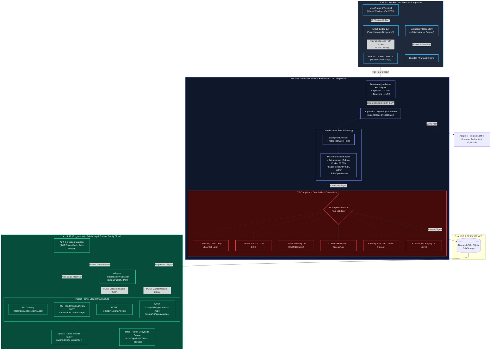
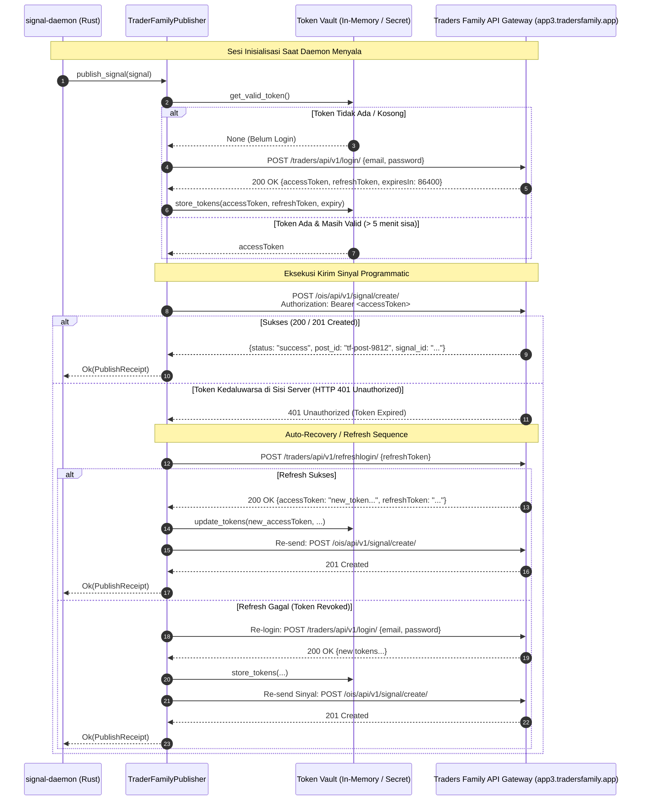

# 🚀 End-to-End Data Pipeline & Traders Family API Automation Guide

Dokumen ini menyajikan arsitektur lengkap **data pipeline hulu ke hilir** dari penerimaan data pasar MetaTrader hingga eksekusi sinyal programmatic ke platform **Traders Family (TF)**, serta analisis teknis mendalam mengenai cara terbaik melakukan reverse engineering API, auto-login, dan token lifecycle management di lingkungan **CachyOS Linux**.

---

## 📊 1. Diagram Pipeline Data Hulu ke Hilir (End-to-End)



---

## 🔐 2. Diagram Alur Autentikasi & Auto-Login Token Lifecycle

Agar daemon dapat mem-publish sinyal secara kontinu tanpa intervensi manual atau sesi kedaluwarsa, publisher menggunakan arsitektur **Self-Healing Token Lifecycle**:



---

## 🔍 3. Analisis: Cara Terbaik Mendapatkan API & Auto-Login

Pertanyaan utama: **"Apakah dengan menginstal BlueStacks atau bagaimana?"**

### ❌ Mengapa BlueStacks BUKAN Pilihan Terbaik:
1. **Inkompatibilitas Linux**: BlueStacks adalah aplikasi eksklusif Windows/macOS. Di CachyOS Linux (Arch), menjalankan BlueStacks via Wine/Proton sangat tidak stabil atau bahkan mustahil karena BlueStacks membutuhkan hypervisor virtualisasi sendiri (Hyper-V / VirtualBox kernel driver).
2. **Resource Hog**: Menjalankan emulator Android GUI 24/7 memakan RAM 4–8 GB dan beban GPU/CPU tinggi hanya untuk menekan tombol "Publish".
3. **Fragile GUI Automation**: Menggunakan OCR atau koordinat klik emulator (klik tombol kirim) sangat rentan gagal jika ada dialog pop-up, promo banner, atau update aplikasi.
4. **Latency Tinggi**: Proses emulasi memakan waktu beberapa detik, padahal eksekusi kuantitatif butuh kepastian waktu.

---

### 🏆 Hirarki Solusi Terbaik (Berdasarkan Robustness & Efisiensi)

| Peringkat | Pendekatan | Reliabilitas | Konsumsi Resource | Kompleksitas Setup | Keterangan |
|:---:|:---|:---:|:---:|:---:|:---|
| 🥇 **Juara 1** | **Direct Headless REST API di Rust (`reqwest`)** | ⭐⭐⭐⭐⭐ (Tinggi) | Minimal (<10 MB RAM) | Sedang (Reverse sekali) | **SANGAT DIREKOMENDASIKAN**. Menggunakan token JWT langsung dari kode Rust. 100% headless. |
| 🥈 **Juara 2** | **Waydroid + `mitmproxy` + Frida (Development/Extraction)** | ⭐⭐⭐⭐ (Tinggi) | Rendah–Sedang | Mudah di CachyOS | **Alat Ekstraksi API**. Waydroid sudah ada di sistem pengguna (`/usr/bin/waydroid`). |
| 🥉 **Juara 3** | **HP Fisik Android + USB Debugging (ADB)** | ⭐⭐⭐⭐⭐ (Murni) | Nol di PC | Sangat Mudah | Paling aman dari deteksi emulator/SafetyNet jika aplikasi TF memproteksi emulator. |
| ⛔ **Dihindari** | **BlueStacks GUI Clicker** | ⭐ (Buruk) | Sangat Boros | Berat & Tidak Stabil di Linux | Tidak layak untuk infrastruktur quant trading serius. |

---

## 🛠️ 4. Playbook Langkah-demi-Langkah Ekstraksi API (Reverse Engineering)

Di sistem Anda (**CachyOS Linux**), alat-alat inti **sudah terinstal**:
- `/usr/bin/mitmproxy`
- `/usr/bin/waydroid`
- `/usr/bin/adb`
- `/usr/bin/jadx`

Berikut adalah 3 fase untuk mendapatkan API contract dan mengotomasi login:

### Fase A: Static Analysis (Melihat Skema API Tanpa Menjalankan App)
Gunakan `jadx` untuk melihat kode sumber aplikasi Traders Family:

```bash
# 1. Dekompilasi APK Traders Family ke folder jadx
jadx -d reverse-engineering/trader-family/jadx reverse-engineering/trader-family/apks/base.apk

# 2. Buka GUI Jadx untuk navigasi source code
jadx-gui reverse-engineering/trader-family/apks/base.apk
```

**Kata Kunci Pencarian di Jadx (`Ctrl+Shift+F`)**:
- `@POST("` atau `@GET("` (Menemukan interface Retrofit)
- `baseUrl` atau `api.tradersfamily`
- `/login`, `/signals`, `/channels`
- `Authorization`, `Bearer`, `X-App-Key`, `Signature`

---

### Fase B: Dynamic Interception (Menangkap Payload Nyata dengan Mitmproxy)

#### Opsi 1: Menggunakan Waydroid (Android Container Native di Linux CachyOS)
```bash
# 1. Pastikan Waydroid terkonfigurasi menggunakan proxy mitmproxy
# Jalankan mitmproxy web interface di Linux
mitmweb --listen-port 8080 --web-port 8081

# 2. Pasang sertifikat CA mitmproxy ke dalam Waydroid:
# Download sertifikat dari http://mitm.it di dalam browser Waydroid
# Atau salin ~/.mitmproxy/mitmproxy-ca-cert.cer ke storage Android Waydroid:
adb push ~/.mitmproxy/mitmproxy-ca-cert.cer /sdcard/Download/
```

#### Opsi 2: Menggunakan HP Android Fisik (Paling Stabil)
1. Sambungkan HP Android ke Laptop via kabel USB (Aktifkan **USB Debugging**).
2. Sambungkan HP ke Wi-Fi yang sama dengan Laptop.
3. Ubah proxy Wi-Fi di HP ke IP Laptop port `8080`.
4. Buka browser HP ke `http://mitm.it`, unduh dan pasang sertifikat CA mitmproxy.

#### Bypass SSL Pinning (Jika Traffic HTTPS Terenkripsi/Gagal Konek)
Jika aplikasi menggunakan SSL Pinning (OkHttp CertificatePinner), gunakan Frida dengan skrip yang sudah ada di proyek:
```bash
# Pasang frida di environment python/arch:
pip install frida-tools --user

# Jalankan bypass SSL pinning ke aplikasi Trader Family:
frida -U -f com.traderfamily.app -l reverse-engineering/trader-family/frida/ssl_unpinning.js
```

---

### Fase C: Replikasi API ke Rust Adapter (`TraderFamilyPublisher`)

Setelah melihat request di web interface mitmproxy (`http://127.0.0.1:8081`):
1. Salin format URL, Headers, dan JSON Body untuk:
   - **Login**: `POST /api/v1/auth/login`
   - **Create Signal**: `POST /api/v1/channels/{channel_id}/signals`
   - **Status Update**: `PATCH /api/v1/channels/{channel_id}/signals/{id}`
2. Masukkan kredensial login (Email & Password) ke dalam `config.toml` atau `.env`:
   ```toml
   [traders_family]
   api_base_url = "https://api.tradersfamily.id"
   email = "analyst@example.com"
   password = "SecurePassword123"
   channel_id = "tf_priority_quant_channel"
   user_agent = "TradersFamily-Android/3.0 (Linux; Android 13)"
   ```

---

## 💻 5. Cetak Biru Implementasi Auto-Login di Rust

Berikut adalah arsitektur kode Rust yang akan dimasukkan ke [`crates/adapters/publisher-traderfamily/src/lib.rs`](file:///home/ihza/Projects/forex/crates/adapters/publisher-traderfamily/src/lib.rs):

```rust
use reqwest::Client;
use serde::{Deserialize, Serialize};
use std::sync::Arc;
use tokio::sync::RwLock;
use chrono::{DateTime, Utc, Duration};

#[derive(Clone)]
pub struct SessionToken {
    pub access_token: String,
    pub refresh_token: String,
    pub expires_at: DateTime<Utc>,
}

pub struct TraderFamilyPublisher {
    config: TraderFamilyConfig,
    client: Client,
    session: Arc<RwLock<Option<SessionToken>>>,
}

impl TraderFamilyPublisher {
    /// Mengambil token aktif, atau melakukan auto-login jika belum ada / expired
    async fn get_valid_token(&self) -> Result<String, DomainError> {
        let mut session_guard = self.session.write().await;
        
        if let Some(ref session) = *session_guard {
            // Jika token masih berlaku > 5 menit, gunakan langsung
            if session.expires_at > Utc::now() + Duration::minutes(5) {
                return Ok(session.access_token.clone());
            }
            
            // Coba refresh token
            if let Ok(new_session) = self.refresh_token_call(&session.refresh_token).await {
                *session_guard = Some(new_session.clone());
                return Ok(new_session.access_token);
            }
        }
        
        // Auto-login baru jika session kosong atau refresh gagal
        let new_session = self.login_with_credentials().await?;
        let token = new_session.access_token.clone();
        *session_guard = Some(new_session);
        Ok(token)
    }

    async fn login_with_credentials(&self) -> Result<SessionToken, DomainError> {
        let url = format!("{}/traders/api/v1/login/", self.config.base_url);
        let resp = self.client.post(&url)
            .json(&serde_json::json!({
                "email": self.config.email,
                "password": self.config.password,
            }))
            .send()
            .await
            .map_err(|e| DomainError::AdapterError(format!("Login gagal: {}", e)))?;

        let data: AuthResponse = resp.json().await
            .map_err(|e| DomainError::AdapterError(format!("Parse login response gagal: {}", e)))?;

        Ok(SessionToken {
            access_token: data.access_token,
            refresh_token: data.refresh_token,
            expires_at: Utc::now() + Duration::seconds(data.expires_in),
        })
    }
}
```

---

## 🎯 6. Ringkasan & Rekomendasi Aksi

1. **JANGAN instal BlueStacks**: Membebani sistem, tidak native di Arch/CachyOS Linux, dan sangat tidak stabil untuk automation jangka panjang.
2. **Manfaatkan Tool yang Sudah Terinstal**:
   - Gunakan `mitmproxy` + HP fisik (atau Waydroid yang sudah ada di sistem Anda) untuk **sekali saja menangkap HTTP traffic** saat Anda membuka dan memposting sinyal di aplikasi Traders Family.
   - Ambil URL endpoint, token format, dan headers.
3. **Eksekusi 100% Native di Rust**:
   - Setelah endpoint diketahui, serahkan seluruh proses ke `crates/adapters/publisher-traderfamily`.
   - Daemon akan berjalan otomatis di latar belakang Linux CachyOS (`cargo run --release --bin signal-daemon`), memantau MetaTrader 5, mendeteksi sinyal Pola N, memvalidasi aturan TF, dan mem-publish secara *headless* via HTTP REST API dengan latensi milidetik.
