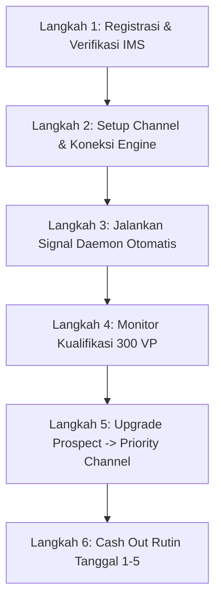

# 📖 Traders Family Analyst Master Playbook & Quant Blueprint

Panduan lengkap, menyeluruh, dan operasional untuk menghasilkan pendapatan konsisten puluhan hingga ratusan juta rupiah per bulan sebagai **Top Analis di Aplikasi Traders Family** menggunakan ekosistem kuantitatif otomatis berbasis **Rust** di repository ini.

---

## 📑 Daftar Isi

1. [🎯 Visi Finansial & Model Bisnis Analis](#1-visi-finansial--model-bisnis-analis)
2. [🏆 Jalur Karier, Level, & Status Kemitraan](#2-jalur-karier-level--status-kemitraan)
3. [⚡ Sistem Valued Pips (VP) & Matriks 4-Tier Pair](#3-sistem-valued-pips-vp--matriks-4-tier-pair)
4. [🛡️ Regulasi Ketat Pembuatan Sinyal (TF App Rules)](#4-regulasi-ketat-pembuatan-sinyal-tf-app-rules)
5. [📊 Algoritma Sistem Scoring 7-Faktor Channel (2026)](#5-algoritma-sistem-scoring-7-faktor-channel-2026)
6. [🧩 Arsitektur Quant Rust: Menjamin Kepatuhan 100%](#6-arsitektur-quant-rust-menjamin-kepatuhan-100)
7. [📅 Playbook Operasional: Dari Nol Hingga Cash Out](#7-playbook-operasional-dari-nol-hingga-cash-out)
8. [🚨 Manajemen Risiko, Anti-Banned, & Anti-Investigasi](#8-manajemen-risiko-anti-banned--anti-investigasi)

---

## 🎯 1. Visi Finansial & Model Bisnis Analis

Di platform Traders Family, seorang analis memperoleh pendapatan bulanan dari **2 pilar utama**:

```
                         TOTAL PENDAPATAN ANALIS / BULAN
                                       │
         ┌─────────────────────────────┴─────────────────────────────┐
         ▼                                                           ▼
   1. REWARD TF POINT                                       2. REVENUE SUBSCRIBERS
(Konsistensi Trading Kuantitatif)                        (Jumlah Pengikut Berbayar)
─────────────────────────────────                       ───────────────────────────
• Diperoleh jika lolos kualifikasi bulanan               • Diperoleh dari biaya langganan copy trade
• Target: Minimal 300 Valued Pips (VP)/bulan            • Dipotong biaya admin Rp 8.000 & fee 17.7%
• Dikalikan Multiplier Level (x0.2 s.d. x0.5)           • Mengendap 30 hari (New -> Active Earnings)
• Nilai Konversi: 1 TF Point = Rp 10.000                • Potensi: Rp 50.000.000 - Rp 200.000.000+/bln
```

### Simulasi Potensi Income Nyata
* **Level Master / Legend (Priority Channel)**
* Perolehan Konsisten: **600 VP / bulan**
* Jumlah Subscriber: **250 orang** (Harga Rp 300.000/bln)
* **Kalkulasi**:
  1. *TF Point*: $500 \times 0.5 + (100 \times 0.5 \times 20\%) = 260\text{ Poin} \rightarrow \mathbf{Rp\ 2.600.000}$
  2. *Subscribers*: $250 \times (\text{Rp } 300.000 - \text{Rp } 8.000 - 17.7\%) \approx \mathbf{Rp\ 59.725.000}$
  3. **Total Take-Home Pay / Bulan**: $\mathbf{Rp\ 62.325.000}$

---

## 🏆 2. Jalur Karier, Level, & Status Kemitraan

### A. Hirarki Level Analis & Bonus Poin
Tingkatan analis ditentukan oleh akumulasi **TF Medal** (diperoleh saat lolos kualifikasi bulanan):

| Level | Syarat Medal | Multiplier VP Profit | Bonus Kenaikan Level (1x) |
| :--- | :---: | :---: | :---: |
| **Newbie** | 0 Medal | - (Belum dapat poin) | - |
| **Rookie** | 1 - 2 Medal | Base Point | +50 TF Point (Rp 500.000) |
| **Pro** | 3 - 4 Medal | **x0.2** | +100 TF Point (Rp 1.000.000) |
| **Elite** | 5 - 7 Medal | **x0.2** | +300 TF Point (Rp 3.000.000) |
| **Master** | 8 - 10 Medal | **x0.3** | +500 TF Point (Rp 5.000.000) |
| **Legend** | 11+ Medal | **x0.5** | Penghargaan Khusus & Skor Max |

### B. Tahapan Status Kemitraan Channel
1. **Basic Channel**: Tahap awal saat baru membuat channel. Wajib lolos kualifikasi minimal 3x dalam 5 bulan.
2. **Prospect Channel**: Tahap inkubasi 3 bulan berturut-turut menjaga performa konsisten.
3. **Priority Channel (Centang Hijau)**: Status kemitraan tertinggi. Memperoleh skor maksimal kemitraan (4 Poin), prioritas display algoritma pencarian di aplikasi, serta pembagian revenue subscriber maksimal.

---

## ⚡ 3. Sistem Valued Pips (VP) & Matriks 4-Tier Pair

Mulai regulasi baru, seluruh penilaian menggunakan **$\text{Valued Pips} = \text{Pips Bersih} \times \text{Value Pair}$**.

### Matriks Klasifikasi 4-Tier Pair Traders Family

| Tier | Daftar Simbol / Pair | Value Pair | Min Jarak Pending | Min SL & TP | Maks SL & TP | Selisih Sinyal 1 ke 2 |
| :---: | :--- | :---: | :---: | :---: | :---: | :---: |
| **Tier 1** | `NZDUSD`, `AUDUSD`, `EURGBP`, `USDCHF` | **2.0** | 10.0 Pips | 10.0 Pips | 200.0 Pips | **50.0 Pips** |
| **Tier 2** | `USDCAD`, `EURUSD`, `GBPUSD`, `NZDJPY`, `CADJPY`, `AUDJPY` | **1.5** | 15.0 Pips | 15.0 Pips | 300.0 Pips | **75.0 Pips** |
| **Tier 3** | `CHFJPY`, `USDJPY`, `EURJPY`, `GBPJPY`, `EURNZD` | **1.0** | 20.0 Pips | 20.0 Pips | 400.0 Pips | **100.0 Pips** |
| **Tier 4** | `XAUUSD` (Gold) | **0.5** | 30.0 Pips | 30.0 Pips | 500.0 Pips | **100.0 Pips** |

> **Contoh Efisiensi Valued Pips**:
> * Profit 100 pips di `NZDUSD` (Tier 1) = $100 \times 2.0 = \mathbf{200\text{ VP}}$.
> * Profit 100 pips di `XAUUSD` (Tier 4) = $100 \times 0.5 = \mathbf{50\text{ VP}}$.
> * **Kesimpulan Strategi**: Fokuskan engine kuantitatif pada pair Tier 1 & Tier 2 untuk mencapai target 300 VP lebih cepat dengan risiko pips pasar yang lebih rendah!

---

## 🛡️ 4. Regulasi Ketat Pembuatan Sinyal (TF App Rules)

Setiap sinyal yang diposting oleh sistem Rust kita **wajib mematuhi 8 invariant**:

1. **Wajib Pending Order**: Tidak diperbolehkan Instant Execution. Hanya boleh `Buy Limit`, `Sell Limit`, `Buy Stop`, `Sell Stop`.
2. **Kepatuhan SLA Salin Sinyal**: Sinyal harus memiliki selang waktu minimal $\ge 5$ menit sebelum harga menyentuh level entry agar tersalin sempurna ke subscriber.
3. **Limit Sinyal per Pair**: Maksimal **2 sinyal aktif per pair** secara bersamaan.
4. **Jarak Antar-Sinyal Searah**: Jika membuat 2 sinyal searah (keduanya Buy / keduanya Sell), jarak level entry sinyal 1 dan 2 wajib memenuhi batas selisih (50/75/100 pips).
5. **Batas Rasio Risk : Reward**:
   * Minimal target $R:R \ge 1:1.5$ s.d. $1:2.0$.
   * **Maksimal $R:R \le 1:3.0$** (TF melarang $R:R > 1:3$).
6. **Maksimal Stop Loss**: Stop Loss maksimal adalah $1.5 \times \text{Take Profit}$.
7. **Durasi Kadaluwarsa (Expired Time)**:
   * Minimal: **1 Jam**.
   * Maksimal: **48 Jam** (khusus sinyal hari Jumat: **96 Jam**).
8. **No-Intervention Rule**: Sinyal yang statusnya sudah **Running (aktif terjemput)** DILARANG KERAS diubah SL/TP atau dibatalkan.

---

## 📊 5. Algoritma Sistem Scoring 7-Faktor Channel (2026)

Harga channel dan ranking analis ditentukan oleh 7 pilar performa 6 bulan terakhir:

```
                            SKOR AKHIR CHANNEL (MAKSIMAL 4.00 POIN)
                                               │
   ┌──────────────┬──────────────┬─────────────┼─────────────┬─────────────┬─────────────┐
   ▼ (17.65%)     ▼ (17.65%)     ▼ (5.88%)     ▼ (17.65%)    ▼ (11.76%)    ▼ (5.88%)     ▼ (23.53%)
 [Level]     [Kemitraan]    [Subscribers]  [Profit Factor] [Loss Ratio] [Profit Mo.]  [Recovery]
```

### Matriks Target Skor Maksimal (4 Poin di Seluruh Faktor)

| Faktor Penilaian | Bobot | Syarat Skor 4 (Sempurna) | Cara Engine Menjamin |
| :--- | :---: | :--- | :--- |
| **1. Recovery Factor** | **23.53%** | $\text{Nett P/L} / \text{Max DD} \ge 8.0$ | Dynamic Pip Buffer & trailing invalidation. |
| **2. Level Channel** | **17.65%** | Level **Legend** (Medal 11+) | Disiplin lolos 300 VP setiap bulan tanpa putus. |
| **3. Kemitraan** | **17.65%** | **Priority Channel** (Centang Hijau) | Daftar kemitraan setiap tanggal 25–28. |
| **4. Profit Factor** | **17.65%** | $PF \ge 2.10$ ($\text{Gross Profit} / \text{Gross Loss}$) | Rasio Risk:Reward minimal 1:2.0 pada setiap trade. |
| **5. Monthly Loss Ratio**| **11.76%** | $0\% - 10\%$ dari rata-rata profit | Cut loss terstruktur berbasis swing leg geometry. |
| **6. Profit Months** | **5.88%** | 6 dari 6 bulan berturut-turut profit | Diversifikasi 6 pair utama (Tier 1 & 2). |
| **7. Total Subscribers** | **5.88%** | $\ge 501$ Subscriber Berbayar | Rating tinggi memicu viralitas organik aplikasi. |

---

## 🧩 6. Arsitektur Quant Rust: Menjamin Kepatuhan 100%

Repo ini dirancang dengan isolasi arsitektural untuk mengeliminasi kesalahan manusia:

```
                                 [ METATRADER 5 BRIDGE EA ]
                                             │ (Sub-ms TCP Stream)
                                             ▼
+───────────────────────────────────────────────────────────────────────────────────────────+
│                                  CORE DOMAIN ENGINE                                       │
│                                                                                           │
│  [ SwingPointDetector ] ──> [ PolaNFormationEngine ] ──> [ TFComplianceValidatorGuard ]   │
│                                                                      │                    │
│   • Validasi Geometri N        • Target R:R 1:2.0 s.d. 1:3.0         • Min/Max SL/TP Tier │
│   • Higher Low / Lower High    • Buffer 1.5 - 2.5 pips               • Max 2 Signal/Pair  │
│                                                                      • Jarak Pending      │
+──────────────────────────────────────────────────────────────────────┼────────────────────+
                                                                       │
                                              [ PASS VALIDATION ] ─────┘
                                               │
                                               ▼
                              [ TraderFamilyPublisher Adapter ]
                                               │ (Encrypted REST API)
                                               ▼
                                  [ TRADERS FAMILY SERVER ]
                                               │
                                  [ Paid VIP Subscriber MT4 ]
```

### Modul Pengendali Kunci:
1. **`crates/core/domain/src/models/pola_n.rs`**: Menghitung formasi Price Action murni khas Traders Family.
2. **`crates/core/domain/src/models/risk.rs`**: Memastikan batasan $R:R \ge 1:2.0$ dan $R:R \le 1:3.0$.
3. **`crates/adapters/publisher-traderfamily/src/lib.rs`**: Reverse-engineered client yang membungkus payload sinyal ke format API resmi Traders Family.

---

## 📅 7. Playbook Operasional: Dari Nol Hingga Cash Out



### Tahap 1: Registrasi & Verifikasi Identitas
1. Buka aplikasi Traders Family, lakukan verifikasi data diri:
   * Foto KTP asli (jelas, tidak buram/terpotong).
   * Data rekening bank atas nama pribadi sesuai KTP.
2. Buat profil channel analis dengan deskripsi metode: *"Quantitative Price Action - Algorithmic Pola N"*.

### Tahap 2: Menjalankan Sistem Kuantitatif
1. Hubungkan EA Bridge ke terminal MetaTrader 5: pasang `ForexHexagonBridge.mq5` di pair target (contoh: `EURUSD`, `GBPUSD`, `NZDUSD`, `AUDUSD`, `USDCHF`).
2. Jalankan background daemon di Linux CachyOS:
   ```bash
   cargo run --release --bin signal-daemon
   ```
3. Daemon akan otomatis menganalisis chart, mendeteksi Pola N, memvalidasi kepatuhan aturan TF, dan memposting sinyal pending order ke channel Anda.

### Tahap 3: Pemantauan Rutin Bulanan
* **Minggu 1–3**: Pantau perolehan pips menuju target $\ge 300\text{ VP}$ dan $\ge 5$ sinyal settle.
* **Tanggal 25–28**: Jika menerima penawaran kemitraan *Priority Channel*, segera klik persetujuan di aplikasi.
* **Tanggal 1–3**: Evaluasi skor channel dan lakukan penyesuaian harga langganan jika rating naik.
* **Tanggal 1–5**: Lakukan request **Cash Out** untuk saldo *Active Earnings*. Dana akan cair ke rekening bank maksimal tanggal 10.

---

## 🚨 8. Manajemen Risiko, Anti-Banned, & Anti-Investigasi

Traders Family memiliki sistem audit otomatis terhadap perilaku curang (*arbitrage*, *grid martiangle ekstrim*, atau *multi-account hedging*). Sistem Rust kita dirancang aman dengan prinsip:

1. **Strict Stop Loss**: Tidak pernah membiarkan sinyal floating tanpa Stop Loss (menghindari penalti dan margin call).
2. **Tidak Melakukan Martingale / Layering Brutal**: Mematuhi aturan jarak selisih sinyal (50–100 pips) sehingga akun subscriber terlindungi 100%.
3. **Penyelarasan Jam Rilis Berita High-Impact**: Integrasi kalender ekonomi `forexfactory-rs` mematikan sementara pembuatan sinyal 15 menit sebelum rilis berita NFP, CPI, dan suku bunga FOMC guna menghindari slippage liar.

---

**Dokumen ini adalah acuan baku operasi quant trading Anda. Pertahankan konsistensi sistem, patuhi batasan invariant, dan raih kesuksesan sebagai Top Analis Traders Family!**
