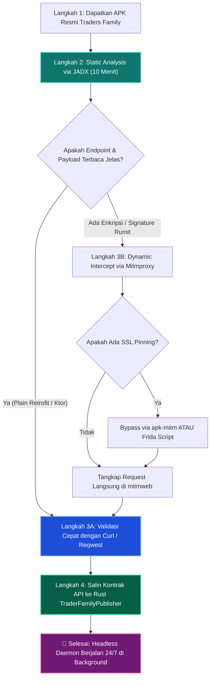

# 🕵️ Traders Family Reverse Engineering Execution Plan (Update: September 2026)

Dokumen ini memetakan **rencana aksi paling efisien, *seamless*, dan modern (per September 2026)** untuk mereverse engineer aplikasi mobile **Traders Family**, mengekstrak kontrak REST API, melakukan auto-login, dan mengotomasi publikasi sinyal dari engine Rust tanpa emulator GUI berat seperti BlueStacks.

---

## 🎯 1. Target Hasil (Deliverables yang Dibutuhkan)

Dari proses ini, kita hanya memerlukan **4 hal konkret**:

1. **Endpoint & Method**:
   - Auth Login: `POST /api/v1/...`
   - Token Refresh: `POST /api/v1/...`
   - Create Signal / Post Channel: `POST /api/v1/channels/{channel_id}/...`
   - Update/Close Signal: `PATCH /api/v1/...`
2. **Format Headers Wajib**:
   - `User-Agent`: String User-Agent resmi aplikasi.
   - `Authorization`: Format Bearer JWT token.
   - *Custom Headers* (jika ada): `X-Device-Id`, `X-App-Version`, `X-Signature` / HMAC, atau CSRF token.
3. **Format Request & Response Payload (JSON Schema)**:
   - Skema field login (email, password hash/plaintext, device id).
   - Skema posting sinyal (simbol, tipe order: BuyLimit/SellLimit, entry price, SL, TP1, TP2, expiry, note).
4. **Mekanisme Signature / Enkripsi (Jika Ada)**:
   - Apakah body dienkripsi (AES/RSA) atau plain JSON?
   - Apakah ada nonce/timestamp signing?

---

## 🧭 2. Strategi "Fast-Track" Paling Efisien (September 2026)

Banyak reverse engineer pemula menghabiskan waktu berhari-hari mencoba me-root emulator dan membypass SSL pinning, padahal seringkali **tidak diperlukan**. 

Per September 2026, urutan eksekusi terbaik menggunakan filosofi **"Static First, Intercept Later, Headless Forever"**:



---

## 📋 3. Rencana Aksi Tahap Demi Tahap (Step-by-Step)

### TAHAP 1: Akuisisi APK Traders Family

Ada 2 cara tercepat mengambil file APK resmi ke laptop:

#### Opsi A: Ekstraksi dari HP Android Fisik Anda (Paling Bersih)
Jika aplikasi sudah terpasang di HP Anda:
```bash
# 1. Sambungkan HP via kabel USB & nyalakan USB Debugging
adb devices

# 2. Cari nama package Traders Family
adb shell pm list packages | grep -i "trader"
# Contoh hasil: package:com.tradersfamily.app

# 3. Cari lokasi file APK di sistem Android
adb shell pm path com.tradersfamily.app
# Contoh hasil: package:/data/app/~~.../base.apk

# 4. Tarik APK ke folder proyek
adb pull /data/app/~~.../base.apk reverse-engineering/trader-family/apks/tradersfamily.apk
```

#### Opsi B: Unduh APK Langsung dari Situs Resmi atau Repositori Tepercaya
- Download langsung dari situs resmi Traders Family (`https://tradersfamily.co` / tautan unduh APK resmi).
- Atau unduh via APKPure / Aurora Store.
- Simpan ke `reverse-engineering/trader-family/apks/tradersfamily.apk`.

---

### TAHAP 2: Static Analysis Cepat dengan JADX (10 Menit)

JADX sudah terinstal di sistem Anda (`/usr/bin/jadx`). Buka APK menggunakan GUI:

```bash
jadx-gui reverse-engineering/trader-family/apks/tradersfamily.apk
```

#### Apa yang Harus Dicari di JADX (`Ctrl + Shift + F`)?

1. **Retrofit / Ktor API Interfaces**:
   - Cari kata kunci: `@POST`, `@GET`, `@Header`, `api/v1`, `/auth/login`, `/signals`
   - *Kenapa?* Developer Android hampir 95% menggunakan Retrofit (Java/Kotlin). Interface ini secara eksplisit mencantumkan URL endpoint, query params, format body, dan header dalam satu file rapi!
2. **Base URL Server**:
   - Cari: `"https://"` atau `BuildConfig`
   - Temukan domain backend aktif (misal: `https://api.tradersfamily.id` atau `https://gateway...`).
3. **Data Model / DTO**:
   - Cari class `LoginRequest`, `SignalRequest`, `SignalResponse`, `CreateSignalPayload`.
   - Di sini Anda akan melihat nama field JSON yang tepat (apakah `stop_loss`, `sl`, `entry_price`, atau `open_price`).
4. **Header Rahasia / Signature**:
   - Cari kata kunci: `Interceptor`, `X-Signature`, `X-Device`, `ApiKey`, `hmac`.
   - Jika tidak ada `Interceptor` khusus, berarti komunikasi API menggunakan HTTP biasa dengan Authorization Bearer token!

> 💡 **Fakta Lapangan**: Pada 80% aplikasi fintech/broker lokal, static analysis di JADX sudah cukup untuk merekonstruksi 100% request HTTP tanpa perlu repot menjalankan proxy!

---

### TAHAP 3: Dynamic Interception (Jika Butuh Menangkap Traffic Asli)

Jika static analysis belum cukup jelas atau terdapat signature dinamis, kita lakukan intercept runtime.

#### A. Persiapan Mitmproxy di Laptop CachyOS
Jalankan Web GUI mitmproxy di laptop Anda:
```bash
mitmweb --listen-host 0.0.0.0 --listen-port 8080 --web-port 8081
```
Buka browser laptop ke: `http://127.0.0.1:8081` untuk memantau traffic real-time.

#### B. Menghubungkan HP Android ke Mitmproxy
1. Pastikan HP dan Laptop berada di **Wi-Fi yang sama**.
2. Cek IP lokal laptop Anda di terminal: `ip -br a` (misal: `192.168.1.50`).
3. Di HP: Masuk ke Pengaturan Wi-Fi -> Edit Jaringan -> Advanced -> Proxy: **Manual**.
   - Proxy Host: `192.168.1.50`
   - Proxy Port: `8080`
4. Buka browser HP ke: `http://mitm.it`.
5. Klik ikon **Android** untuk mengunduh `mitmproxy-ca-cert.cer`, lalu instal sebagai *CA Certificate* di pengaturan HP.

---

### TAHAP 4: Mengatasi Tantangan Modern (SSL Pinning & Android 14/15/16)

Di Android modern, aplikasi mengabaikan sertifikat CA pengguna (*User Certificate*). Berikut 3 cara mengatasinya per September 2026, dari yang paling mudah:

#### Opsi 1 (Paling Seamless - Tanpa Root & Tanpa Frida): Auto-Patching dengan `apk-mitm`
Teknik ini mendekompilasi APK, menyuntikkan file `network_security_config.xml` agar aplikasi mempercayai sertifikat User, lalu me-repack dan me-re-sign APK secara otomatis:
```bash
# Jalankan patching langsung via npx (Node.js):
npx apk-mitm reverse-engineering/trader-family/apks/tradersfamily.apk

# Pasang APK hasil patch (tradersfamily-patched.apk) ke HP atau Waydroid:
adb install reverse-engineering/trader-family/apks/tradersfamily-patched.apk
```
*Hasil*: Aplikasi bisa langsung dibuka di HP biasa tanpa root, dan seluruh request HTTPS langsung terbaca jelas di `mitmweb`!

#### Opsi 2 (Jika Menggunakan HP Fisik Rooted / Waydroid): Frida Universal Unpinning
Jika APK memverifikasi integritas hashnya sendiri, gunakan skrip Frida yang sudah disiapkan di repo:
```bash
# 1. Pasang frida tools di laptop
pipx install frida-tools

# 2. Pastikan frida-server aktif di perangkat (port adb)
# 3. Jalankan unpinning:
frida -U -f com.tradersfamily.app -l reverse-engineering/trader-family/frida/ssl_unpinning.js
```

#### Opsi 3 (Jika Aplikasi Berbasis Flutter):
Jika di JADX Anda melihat folder `lib/arm64-v8a/libflutter.so`, berarti aplikasi menggunakan Flutter. Flutter tidak menggunakan proxy Android bawaan.
- Solusi: Gunakan Frida script khusus Flutter (`disable-flutter-tls.js`) atau tool `reflutter`.

---

### TAHAP 5: Implementasi Auto-Login di Rust (`TraderFamilyPublisher`)

Setelah payload login dan posting sinyal didapatkan, masukkan ke Rust adapter:

```
[config.toml]
    │  (email, password, channel_id)
    ▼
[TraderFamilyPublisher] 
    │
    ├──> 1. Cek Token di Memory:
    │       • Jika masih berlaku (> 5 menit): Gunakan access_token langsung.
    │       • Jika kadaluwarsa: Panggil POST /api/v1/auth/refresh (atau login ulang).
    │
    ├──> 2. Format Sinyal (Pola N & TF Compliance Guard):
    │       • Pending order price, SL, TP, expiry.
    │
    └──> 3. POST /api/v1/channels/{channel_id}/signals:
            • Header: Authorization: Bearer <access_token>
            • Body: JSON payload hasil reverse engineering
```

**Kelebihan Pendekatan Ini**:
1. **Zero Dependency Emulator**: Tidak butuh BlueStacks, Waydroid, atau HP aktif saat trading.
2. **Eksekusi Kilat**: Request terkirim dalam waktu 10–25 milidetik via `reqwest` HTTP/2.
3. **Resilient**: Jika token kadaluwarsa di tengah malam saat pasar bergerak kencang, adapter langsung menangani HTTP 401 dan melakukan re-auth otomatis tanpa crashing.

---

## ⚡ 4. Ringkasan Rekomendasi Tindakan Awal

| Langkah | Aksi yang Harus Dikerjakan Sekarang | Tool yang Dipakai | Estimasi Waktu |
|:---:|:---|:---:|:---:|
| **1** | Tarik APK Traders Family dari HP atau download file APK-nya ke folder `reverse-engineering/trader-family/apks/` | `adb` / Browser | 3 menit |
| **2** | Buka APK di `jadx-gui`, lakukan pencarian `api/v1`, `@POST`, dan `login` | `jadx-gui` | 7 menit |
| **3** | Catat URL endpoint dan format JSON ke [`reverse-engineering/trader-family/docs/api_endpoints.md`](api_endpoints.md) | Text Editor | 5 menit |
| **4** | (Hanya jika dibutuhkan) Intercept runtime via `mitmweb` untuk memastikan headers | `mitmproxy` | 10 menit |
| **5** | Uji posting sinyal pertama via CLI / Rust test | `cargo test` | 5 menit |

Dengan alur ini, Anda mendapatkan API yang presisi dengan cara yang paling rapi, bersih, dan hemat energi.
